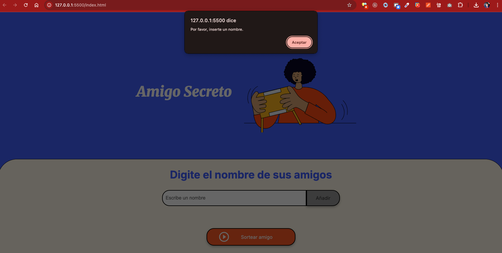
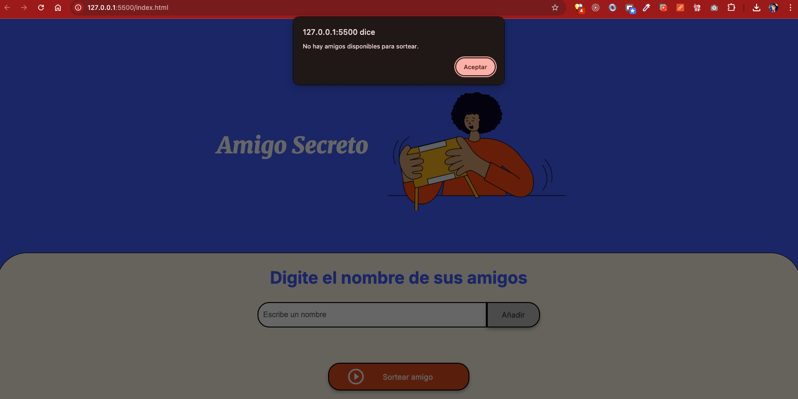
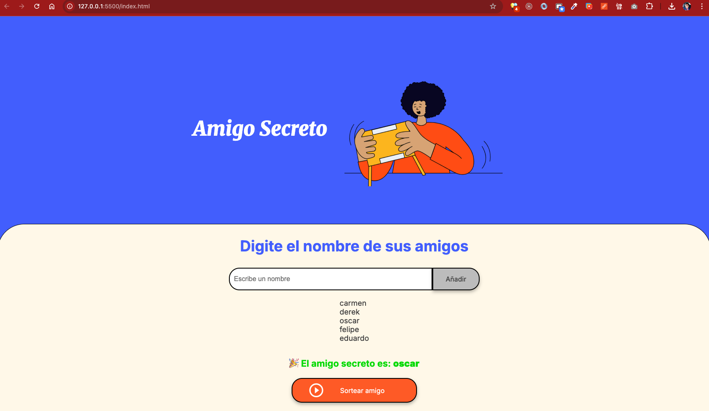

# 🎁 Amigo Secreto

Proyecto simple en JavaScript para ingresar nombres de amigos y realizar un sorteo aleatorio.

## 🚀 Funcionalidades
1. **Agregar amigos**  
   - El usuario escribe un nombre en el campo de texto.  
   - Se valida que no esté vacío.  
   - Se agrega el nombre al array `amigos` y se muestra en una lista.  

2. **Mostrar lista de amigos**  
   - Cada nombre se muestra en un elemento `<li>`.  
   - La lista se actualiza cada vez que se agrega un nuevo amigo.  

3. **Sortear un amigo**  
   - Selecciona un nombre aleatorio de la lista.  
   - Muestra el resultado en pantalla.  
   - Si no hay amigos, muestra un mensaje de alerta.  

## 📂 Estructura del proyecto

```
.
├── index.html
├── style.css
├── app.js
└── assets/
└── assets/readme
```

## 🛠️ Tecnologías
- **HTML5**  
- **CSS3**  
- **JavaScript (ES6)**

## ▶️ Uso
1. Abre `index.html` en el navegador.  
2. Ingresa los nombres de tus amigos y presiona **Añadir**.  
3. Cuando tengas la lista, presiona **Sortear amigo** para obtener un resultado aleatorio.

## 📷 Ejemplos de uso

### Error al dejar el campo vacío



### Mensaje cuando se sortea un amigo
